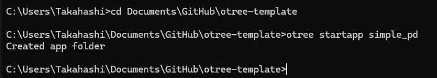

# 1. はじめに

東京大学で社会心理学の研究をしている D1 の[髙橋龍](https://ryu-thakahashi.github.io/)と申します．

この記事では，**oTree** を使った簡単な社会実験（囚人のジレンマゲーム）の実装方法について解説していきます！

（この記事は oTree のセットアップについて，以下の記事を前提として書かれています）
[【初心者向け】oTree を自分の PC で動かす！【Windows 編】 #Python - Qiita](https://qiita.com/ryu-takahashi2718/items/115279df1426b5ccae37)

今回は **「囚人のジレンマゲーム」と呼ばれる経済ゲーム** を題材に，超シンプルなサンプルを作ってみましょう！
このコードを理解できると， **一対一で他者とインタラクションをする実験の作り方** がわかるようになります．最後まで一緒に頑張りましょう！

※ 今回の記事は otree==5.11.1 を前提としています．バージョンが心配な方は，上記の記事を参考に環境構築を行ってください．

# 2. 今回実装する実験の概要

## 2.1 囚人のジレンマとは

囚人のジレンマは一見すると難しそうですが，実はふつうの生活の中でもよく見られる構造です．

たとえば，あなたと友達が一緒に授業のレポートを出すとします．2 人で分担して，うまくやればラクに終わるはず．
しかし，どちらかが「相手がちゃんとやってくれるだろう」と思ってサボると，自分だけ得をします．
問題は，もしお互いに「相手がやってくれるでしょ」って思ってサボったら…当然レポートは提出できず，2 人とも単位を落としてしまいます（社会的ジレンマ）

今回の記事では，このジレンマの仕組みを実際に体験できる，簡単な実験を作ります．
2 人がお互いに「協力する」か「裏切る」かを選び，協力すれば 2 人とも得をするけど，裏切れば自分だけが得をしやすい…
でも，2 人とも裏切ると最悪な結果になる．そんなルールで進めます．

## 2.2 今回の実験状況

- **プレイヤー数**: 2 人
- **プレイヤーの行動**：「協力」 or 「非協力」を選ぶ
- **目標**: oTree を使ってこのロジックを実装し，Web 上で簡単に実験を回せるようにする

# 3. フォルダの作成

## 3.1 `otree startapp` でフォルダを作成する

oTree のアプリを作るときは，まずターミナルやコマンドプロンプトで，以下のコマンドを打ちます．

**手順**

1. コマンドプロンプト，ターミナルを開く
   1. Windows の場合：Windows キーを押して「cmd」と入力し，Enter
   2. Mac の場合：Spotlight 検索で「ターミナル」と入力し，Enter
2. oTree のプロジェクトフォルダに移動
   ```bash
   cd path/to/your/otree_project
   ```
3. `otree startapp simple_pd` を入力し，実行

イメージはこんな感じです．
（`Created app folder` が表示されれば成功です！）



## 3.2 作成されたファイル構造の確認

`otree startapp` コマンドを実行すると，`simple_sd` フォルダ配下に以下のようなファイルが出来上がります．


- `__init__.py`
- `MyPage.html`
- `Results.html`

この通りできていれば，次のステップに進んでいきましょう！

# 4. 実装コードの概要

ここからは実際にコードを編集していきます．oTree は **`__init__.py`** に実験ロジックや設定を書き込むのが特徴的です．
今回は「グループメンバーで協力する人が多いほど利得が増える」というルールを実装していきます．

（難しい言葉が続くので，よく分からない人は「5. メインロジックの解説」まで読み飛ばしても大丈夫です！）

## 4.1 `__init__.py` による実験ロジックの記述

oTree では，下記のように定数やプレイヤー数を管理する `C` クラス，実験の進行管理を行う `Subsession` / `Group` / `Player` クラスなどを定義します．また，ページ遷移に関するクラス（ここでは `Page` など）もこの中に書いていきます．

## 4.2 HTML ファイル（ページテンプレート）の役割

ユーザーが実際に目にする画面は，**HTML ファイル** で決定します．oTree 独自のテンプレートタグ（`{{ formfields }}` など）が使えて，Python コード側と連動してフォームや結果を表示できます．

## 4.3 全体のディレクトリ構成

最終的にはこんな構成を想定しています:

```
simple_sd/
├─ __init__.py    # 実験のメインコード
├─ MyPage.html    # プレイヤーが選択するページ
└─ Results.html   # 結果表示ページ
```

それでは，実際のコードを見ていきましょう！

# 5. メインロジックの解説

`__init__.py` を開いてください．すると，以下のようなコードが記述されているはずです．


まずは，オレンジ色の枠の部分を編集しましょう．


以下のコードに編集してください．

```python
# __init__.py

class C(BaseConstants):
    NAME_IN_URL = 'simple_sd'
    PLAYERS_PER_GROUP = 3
    NUM_ROUNDS = 1
    BC_RATIO = 3
```

これで，定数や設定値を管理する `C` クラスの実装が完了しました．
次に，`Subsession` / `Group` / `Player` クラスを実装していきます．以下のコードのオレンジ色の部分を編集してください．


```python
# __init__.py

class Subsession(BaseSubsession):
    def creating_session(self):
        if self.session.config.get("players_per_group"):
self.session.config["players_per_group"] = C.PLAYERS_PER_GROUP

            self.session.config["players_per_group"] = C.PLAYERS_PER_GROUP

class Group(BaseGroup):
    def set_payoffs(group: BaseGroup):
        players = group.get_players()

        num_cooperators = sum([p.decision == "協力" for p in players])
        group_payoff = num_cooperators * C.BC_RATIO
        for p in players:
            p.payoff = group_payoff / C.PLAYERS_PER_GROUP
            p.group_num_cooperators = num_cooperators

class Player(BasePlayer):
    decision = models.StringField(
        choices=['協力', '非協力'],
        widget=widgets.RadioSelectHorizontal,
        doc="""プレイヤーが協力するかどうか"""
    )
    group_num_cooperators = models.IntegerField(doc="グループ内の協力者数")
```

最後に，ページ遷移に関するクラスを実装します．以下のコードのオレンジ色の部分を編集してください．


```python
# __init__.py

# PAGES
class MyPage(Page):
    form_model = 'player'
    form_fields = ['decision']

class ResultsWaitPage(WaitPage):
    after_all_players_arrive = Group.set_payoffs

class Results(Page):
    @staticmethod
    def vars_for_template(player: Player):
        group_players = player.get_others_in_group()
        return {
            "player": player,
            "num_cooperators": player.group_num_cooperators,
            "group_players": group_players,
            "total_players": len(group_players),
            "payoff": player.payoff
        }
```

これで，実験のメインロジックが完成しました！
ここまでくれば，あとは HTML ファイルを編集して，実際の画面を作成するだけです．
あと少しです．頑張りましょう！

このセクションの残りの部分では，各クラスや編集したコードの解説をします．**初学者の方は「6. ページテンプレート (HTML) の解説」まで読み飛ばしても大丈夫**です！

## 5.1 C クラスの実装と解説 (定数，設定値)

- **`PLAYERS_PER_GROUP = 3`** で，1 グループ 3 人に固定．
- **`NUM_ROUNDS = 1`** で，今回は 1 ラウンドだけ．
- **`BC_RATIO = 3`** は，協力が多いほど利得が大きくなる比率です．たとえば，協力者が 2 人なら合計利得は 6，3 人なら 9，など．

## 5.2 Subsession / Group / Player クラスの解説 (実験の根幹ロジック)

- **`Subsession`**: セッション開始時の設定を記述する場所です．ここでは特にプレイヤー数の設定を行っています．
- **`Group`**: プレイヤーの選択から利得を算出するロジックを管理します．`set_payoffs` という名前のメソッドはよく使われるので，ぜひ覚えておきましょう．
- **`Player`**: 各プレイヤー個別の情報を保持します．ここでは `decision` (協力か非協力か) と `group_num_cooperators` (グループ内の協力者数) を記録しています．

## 5.3 ページクラスの解説 (入力ページ，WaitPage，結果表示ページ)

- **`MyPage`**: プレイヤーが協力 or 非協力を選ぶ入力ページ．`form_fields` で指定された項目が表示されます．
- **`ResultsWaitPage`**: 全プレイヤーの回答が集まるまで待つページ．このページで `Group.set_payoffs` を呼び出し，全員の利得を一括計算しています．
- **`Results`**: 結果表示ページ．全プレイヤーの選択状況や自分の利得などを見せています．

# 6. ページテンプレート (HTML) の解説

このセクションでは，`MyPage.html` と `Results.html` の HTML テンプレートを解説します．
参加者に対してどのような画面を表示するか，を決定するのが HTML ファイルの役割です．

## 6.1 `MyPage.html` の解説

MyPage.html を開いてください．以下のようなコードが記述されているはずです．


こちらのコードを以下のように編集してください．

```html
<!-- simple_sd/MyPage.html -->

 Decision  
<p>どちらかを選んでください．</p>
{{ formfields }} {{ next_button }} 
```

**補足説明**

oTree でよく使うテンプレートタグ:

- `{{ formfields }}`: Python 側で指定した `form_fields` の入力フォームが生成される部分
- `{{ next_button }}`: 次のページへ進むボタン

## 6.2 `Results.html` の解説

次に，Results.html を開いてください．以下のようなコードが記述されているはずです．


こちらのコードを以下のように編集してください．

```html
<!-- simple_sd/Results.html -->

 Results  
<p>あなたの選択は{{ player.decision }}です．</p>
<p>他の人の選択：</p>
<ul>
	
	<li>Player {{p.id_in_group}}: {{ p.decision }}</li>
	
</ul>
<p>協力者の数：{{ num_cooperators }}</p>
<p>あなたの利得：{{ player.payoff }}</p>

{{ next_button }} 
```

これで，HTML テンプレートの編集も完了です！
最後に，このアプリケーションを実際に動かすために必要な手順 （`settings.py` への追加）と実行方法について説明します．

**補足説明**

- `{{ player.decision }}` は Python 側の変数から取得した内容を表示しています．
- `group_players` から `` でループを回すことで，他のプレイヤーの選択を列挙しています．

# 7. アプリの実行

## 7.1 `settings.py` への追加

/otree-template/setting.py を開いてください．
すると，以下のようなコードが記述されているはずです．


この画像のオレンジ色の部分に以下のコードを追加してください．

```python
# settings.py

dict(
   name="simple_sd",
   app_sequence=["simple_sd"],
   num_demo_participants=3,
   players_per_group=3,
),
```

下の画像のような状態になれば成功です！


## 7.2 `otree devserver` でサーバーを起動

コードの編集が終わったら，コマンドプロンプトやターミナルで:

```bash
otree devserver
```

を実行してください．
成功すると，以下のような画面になるはずです．


成功したら，`http://localhost:8000` （または表示された URL）にアクセスできるはずです．
アクセス後に以下のような画面になれば，成功です！


## 7.3 簡単な動作確認

1. ブラウザで `http://localhost:8000/` を開く（上の画像のような画面にになっていれば OK！）．
2. 今回のアプリ（`simple_sd`）をクリックする．
3. 画面中央にある「Play in split screen mode」（オレンジ色の枠）をクリックする．


4. 画面上部が管理者画面，下部がプレイヤー画面になります．画面を操作して，どんな動きをするか確認してみましょう！


以上で，実験の実装と実行が完了しました！
ここまで完走した皆さんはとても素晴らしいです！！！

# 8. 拡張のアイデア

このようなシンプルなひな形があれば，様々な実験を作ることができます．以下は，このサンプルを拡張するアイデアですので，ぜひ参考にしてください！

- **ラウンド数を増やす**  
  例えば `C.NUM_ROUNDS = 5` に変更すると，全 5 ラウンド分の選択と結果表示を行えます．
- **参加者数を増やす**  
  `C.PLAYERS_PER_GROUP = 5` などに変えてグループ人数を増やすだけで，より多人数の協力ゲームになります．
- **WaitPage の改良**  
  結果表示前に，チャットページ（Chat クラスを使用）や追加の質問ページを挟むなど，ユーザーインタラクションを強化できます．
- **利得計算の変更**  
  協力数に応じてペナルティが発生するルール，あるいは非協力者の利得をあえて高くするルールなどに書き換えることで，社会的ジレンマの多様なバリエーションを試せます．
- **連続的な協力の導入**
  今回は「協力」か「非協力」かの 2 択でしたが，スライダーを使って連続的な協力度を選択できるようにすると，よりリアルな社会的ジレンマを再現できます．

# 9. まとめ

ここまで読んでいただきありがとうございます！  
今回は「社会的ジレンマ」を題材に，oTree で最小限の機能を持つサンプル実験を作ってみました．oTree は「Python を使った Web 実験」というと一見難しそうですが，シンプルなプロジェクト構成とテンプレートのおかげで，初めての人でも比較的スムーズに始められます．

**押さえておきたいポイント**

- `__init__.py` にロジックが集中している
- HTML テンプレートを使って画面を自由にデザインできる
- WaitPage を使って全プレイヤーが入力を完了するのを待ち，共通の利得計算を行う

このあたりを理解しておけば，応用で色々な実験を作りやすくなります．

以上が，今回のサンプル実験の解説です．  
ぜひ，記事の構成やコードをもとに，いろんな形の社会実験を作ってみてください！もし分からないところがあれば，公式ドキュメントをチェックしたり，コミュニティに質問してみたりするとよいですよ．皆さんの研究や学習に役立てば嬉しいです！

# 謝辞

本記事は，以下の手順で作成しました．（ChatGPT さん，いつもありがとうございます）

- 筆者がコードを作成
- ChatGPT に記事の目次案を提案してもらうい
- 筆者が目次案に修正を加える
- 目次の修正案に対して ChatGPT からフィードバックをもらう
- フィードバックされた目次に問題がなかったので，その目次案をもとにして原稿の執筆をしてもらう
- その原稿を筆者が加筆・修正
