# 1. はじめに

東京大学で社会心理学の研究をしている D1 の[髙橋龍](https://ryu-thakahashi.github.io/)と申します．

この記事では，**oTree** を使った簡単な社会実験の実装方法について解説していきます！

（この記事は oTree のセットアップについて，以下の記事を前提として書かれています）
[【初心者向け】oTree を自分の PC で動かす！【Windows 編】 #Python - Qiita](https://qiita.com/ryu-takahashi2718/items/115279df1426b5ccae37)

今回は「信頼ゲーム」という経済ゲームをシンプルな形で作ってみましょう！
このコードを理解できると，「相手の反応によって，人の行動はどう変わるか」といった実験がｄになります．最後まで一緒に頑張りましょう！

※ 今回の記事は otree==5.11.1 を前提としています．バージョンが心配な方は，上記の記事を参考に環境構築を行ってください．

# 2. 今回実装する実験の概要

## 2.1 信頼ゲームとは

信頼ゲームとは，「ある人が相手を信頼してリスクを取ることで，全体としてより大きな利益を得られるが，相手が裏切るとその人だけが損をする」というような状況を指します．
例えば，友人にお金を貸すとき，「返してくれる」と信じれば大きな関係性の強化が得られるかもしれませんが，返してくれなければ貸した側だけが損をします．
このように，信頼に応えることが双方にとって良い結果をもたらすにも関わらず，裏切りの誘惑が常に存在する……という矛盾が信頼ゲームの本質です．

今回の記事では，その信頼と応答のやりとりを簡単な形で体験できる，極めてシンプルな実験を作りましょう．
具体的には，「信頼する」か「信頼しない」かを先手が選び，「返す」か「裏切る」かを後手が選ぶ——
そして，お互いの選択によって報酬が変わる，相互依存的な意思決定ゲームです．

## 2.2 今回の実験状況

- **プレイヤー数**: 2 人
- **役割**：「送る人」と「返す人」
- **プレイヤーの行動**：どちらの役割の人も「相手に何ポイントを与えるか」
- **目標**: oTree を使ってこのロジックを実装し，Web 上で簡単に実験を回せるようにする

# 3. フォルダの作成

## 3.1 `otree startapp` でフォルダを作成する

oTree のアプリを作るときは，まずターミナルやコマンドプロンプトで，以下のコマンドを打ちます．

**手順**

1. コマンドプロンプト，ターミナルを開く
   1. Windows の場合：Windows キーを押して「cmd」と入力し，Enter
   2. Mac の場合：Spotlight 検索で「ターミナル」と入力し，Enter
2. oTree のプロジェクトフォルダに移動
   ```bash
   cd path/to/your/otree_project
   ```
3. `otree startapp simple_tg` を入力し，実行

イメージはこんな感じです．`Created app folder` が表示されれば成功です！
（エラーが出た場合は，以下の Case1, Case2 をご参照ください）

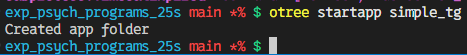

### Case 1: 既にあるというエラー

こういうエラーが出たときは，

```
There is already an app called "simple_tg" in this folder. Either delete that folder first, or use a different name.
```

simple_tg が既にあるということ．なので，simple_tg を削除して再度 `otree startapp simple_tg` を実行してみてください

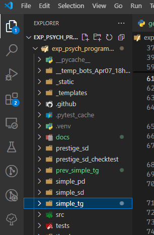

### Case 2: AssertionError と出る

こんな感じのエラーが出たら，


`settings.py` というファイルに `simple_tg` が登録されてしまっているはずです．

なので，`settings.py`を開いて，


オレンジ色の枠の部分を削除してください．

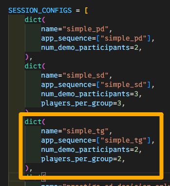

無事に削除出来たら，再度 `otree startapp simple_tg` を実行してみてください！

## 3.2 作成されたファイル構造の確認

`otree startapp` コマンドを実行すると，`simple_tg` フォルダ配下に以下のようなファイルが出来上がります．


- `__init__.py`
- `MyPage.html`
- `Results.html`

この通りできていれば，次のステップに進んでいきましょう！

# 4. 実装コードの概要

ここからは実際にコードを編集していきます．oTree は **`__init__.py`** に実験ロジックや設定を書き込むのが特徴的です．
今回は「グループメンバーで協力する人が多いほど利得が増える」というルールを実装していきます．

（難しい言葉が続くので，よく分からない人は「5. メインロジックの解説」まで読み飛ばしても大丈夫です！）

## 4.1 `__init__.py` による実験ロジックの記述

oTree では，下記のように定数やプレイヤー数を管理する `C` クラス，実験の進行管理を行う `Subsession` / `Group` / `Player` クラスなどを定義します．また，ページ遷移に関するクラス（ここでは `Page` など）もこの中に書いていきます．

## 4.2 HTML ファイル（ページテンプレート）の役割

ユーザーが実際に目にする画面は，**HTML ファイル** で決定します．oTree 独自のテンプレートタグ（`{{ formfields }}` など）が使えて，Python コード側と連動してフォームや結果を表示できます．

## 4.3 全体のディレクトリ構成

最終的にはこんな構成を想定しています:

```
simple_tg/
├─ __init__.py    # 実験のメインコード
├─ MyPage.html    # プレイヤーが選択するページ
└─ Results.html   # 結果表示ページ
```

それでは，実際のコードを見ていきましょう！

# 5. メインロジックの解説

`__init__.py` を開いてください．すると，以下のようなコードが記述されているはずです．


まずは，オレンジ色の枠の部分を編集しましょう．

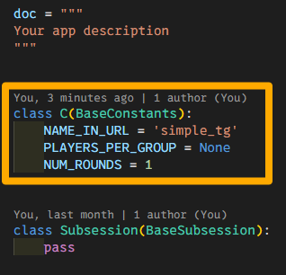
以下のコードに編集してください．

```python
# __init__.py

class C(BaseConstants):
    NAME_IN_URL = "simple_tg"
    PLAYERS_PER_GROUP = None
    NUM_ROUNDS = 1
    ENDOWMENT = 100
    BC_RATIO = 3
```

これで，定数や設定値を管理する `C` クラスの実装が完了しました．
次に，`Subsession` / `Group` / `Player` クラスを実装していきます．以下のコードのオレンジ色の部分を編集してください．

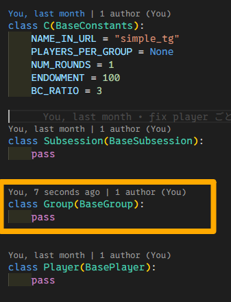

```python
# __init__.py

class Group(BaseGroup):
    send_amount = models.CurrencyField(min=0, max=100)
    send_back_amount = models.CurrencyField()

```

利得を計算するための関数を書きます．ここは難しいので，あまり気にしなくても大丈夫ですが，このような関数を自分で書けると開発の幅がぐっと広がります！

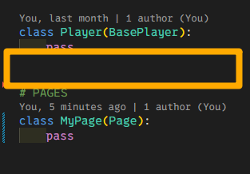

```python
# __init__.py

# FUNCTIONS
def multiplying_send_amount(send_amount: int):
    return send_amount * C.BC_RATIO


def calculate_sender_payoff(send_amount: int, send_back_amount: int):
    return C.ENDOWMENT - send_amount + send_back_amount


def calculate_sendbacker_payoff(send_amount: int, send_back_amount: int):
    return multiplying_send_amount(send_amount) - send_back_amount


def set_payoffs(group: Group):
    group.get_player_by_id(1).payoff = calculate_sender_payoff(
        group.send_amount, group.send_back_amount
    )
    group.get_player_by_id(2).payoff = calculate_sendbacker_payoff(
        group.send_amount, group.send_back_amount
    )

```

次に，ページ遷移に関するクラスを実装します．以下のコードのオレンジ色の部分を編集してください．

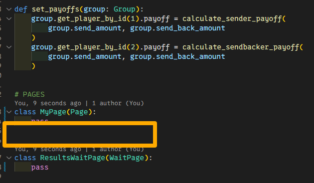

```python
# __init__.py

# PAGES
class Send(Page):
    form_model = "group"
    form_fields = ["send_amount"]

    @staticmethod
    def is_displayed(player: Player):
        return player.id_in_group == 1

    @staticmethod
    def vars_for_template(player: Player):
        return {"endowment": C.ENDOWMENT}

class WaitSend(WaitPage):
    @staticmethod
    def is_displayed(player: Player):
        return player.id_in_group == 2

```

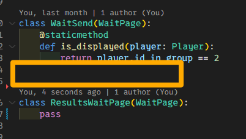

```python
# __init__.py

class SendBack(Page):
    form_model = "group"
    form_fields = ["send_back_amount"]

    @staticmethod
    def is_displayed(player: Player):
        return player.id_in_group == 2

    @staticmethod
    def vars_for_template(player: Player):
        group = player.group
        return {"multiplyed_send_amount": multiplying_send_amount(group.send_amount)}


class WaitSendbacker(WaitPage):
    @staticmethod
    def is_displayed(player: Player):
        return player.id_in_group == 1

```

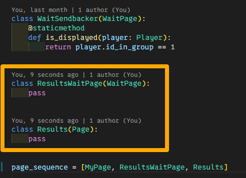

```python
# __init__.py

# PAGES
class ResultsWaitPage(WaitPage):
    after_all_players_arrive = set_payoffs


class Results(Page):
    @staticmethod
    def vars_for_template(player: Player):
        group = player.group
        return {
            "payoff": player.payoff,
            "bc_ratio": C.BC_RATIO,
            "send_amount": group.send_amount,
            "multiplyed_send_amount": multiplying_send_amount(group.send_amount),
            "send_back_amount": group.send_back_amount,
            "total_send_amount": group.get_player_by_id(1).payoff,
            "total_received_amount": group.get_player_by_id(2).payoff,
        }
```

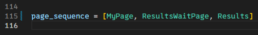

```python
# __init__.py

page_sequence = [
    Send,
    WaitSend,
    SendBack,
    WaitSendbacker,
    ResultsWaitPage,
    Results,
]
```

これで，実験のメインロジックが完成しました！
ここまでくれば，あとは HTML ファイルを編集して，実際の画面を作成するだけです．
あと少しです．頑張りましょう！

このセクションの残りの部分では，各クラスや編集したコードの解説をします．**初学者の方は「6. ページテンプレート (HTML) の解説」まで読み飛ばしても大丈夫**です！

## 5.1 C クラスの実装と解説 (定数，設定値)

- **`PLAYERS_PER_GROUP = None`** で，1 グループ 3 人に固定．
- **`NUM_ROUNDS = 1`** で，今回は 1 ラウンドだけ．
- **`BC_RATIO = 3`** とすることで，「送る人」の送ったポイントが 3 倍になって「返す人」に渡される設定

## 5.2 Subsession / Group / Player クラスの解説 (実験の根幹ロジック)

- **`Group`**: プレイヤーの選択から利得を算出するロジックを管理します．`set_payoffs` という名前のメソッドはよく使われるので，ぜひ覚えておきましょう．

## 5.3 ページクラスの解説 (入力ページ，WaitPage，結果表示ページ)

- **`Send`**: プレイヤー 1（信頼者）が送金額を入力するページです．`form_fields` で `"send_amount"` が指定されており，この値を通じて相手への信頼の大きさを表します．
- **`WaitSend`**: プレイヤー 2（応答者）がプレイヤー 1 の送金を待つページです．プレイヤー 1 が送金処理を終えるまで，このページで待機します．
- **`SendBack`**: プレイヤー 2（応答者）が送られてきた金額を受け取り，その一部を返すかどうかを決めるページです．`form_fields` に `"send_back_amount"` が指定されており，信頼に応えるか裏切るかの選択が行われます．
- **`WaitSendbacker`**: プレイヤー 1 が，プレイヤー 2 の応答を待つページです．プレイヤー 2 の送金処理が完了するまで，このページで待機します．
- **`ResultsWaitPage`**: 両者の行動が完了するまで待機するページです．このページで `Group.set_payoffs` を呼び出し，信頼と応答に基づいて双方の利得が計算されます．
- **`Results`**: 結果表示ページです．送金額や返金額，そして自分と相手の最終的な利得が表示され，ゲームの結果を振り返ることができます．

# 6. ページテンプレート (HTML) の解説

このセクションでは，`Send.html`，`SendBack.html`， `Results.html` の HTML テンプレートを解説します．
参加者に対してどのような画面を表示するか，を決定するのが HTML ファイルの役割です．

## 6.1 `Send.html` の解説

まずは， `Send.html` を作成します．オレンジ色の枠を順番に右クリックしていき，「New File...」をクリックしてください．

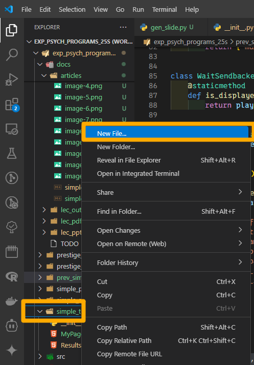

新たなファイルが作成されるので，`Send.html` と入力してください．
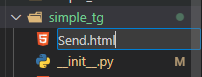

先ほど作成した `Send.html` を開いてください．以下のような画面になれば OK です！

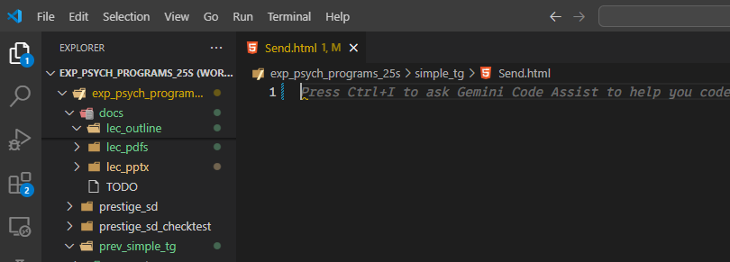

この `Send.html` にを以下のように編集してください．

```html
<!-- simple_tg/Send.html -->

{{ block title }} Send {{ endblock }} {{ block content }}

<p>あなたは <strong>最初に送る人</strong> に選ばれました</p>
<p>
	あなたは
	<strong>{{ endowment }}</strong>
	ポイントを持っています．
</p>
<p>{{ endowment }} ポイントのうち，何ポイントをペアに与えますか？</p>
{{ formfields }} {{ next_button }} {{ endblock }}
```

**補足説明**

- `{{ formfields }}`: Python 側で `form_fields = ["send_amount"]` と指定したフォームが表示されます．
- `{{ next_button }}`: 次のページへ進むボタン

## 6.2 `SendBack.html` の解説

次に，信頼を受けたプレイヤーが応答するためのページ `SendBack.html` を作成します．先ほどと同様，オレンジ色の枠を順番に右クリックしていき，「New File...」をクリックしてください．


新たなファイルが作成されるので，`SendBack.html` と入力してください．

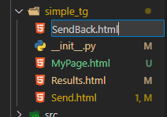

下のような画面になれば OK です！

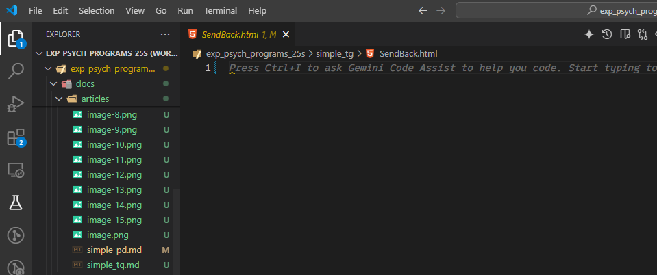

`SendBack.html` を以下のように編集してください．

```html
<!-- simple_tg/SendBack.html -->

{{ block title }} Send back {{ endblock }} {{ block content }}

<p>あなたは <strong>お返しする人</strong> に選ばれました</p>
<p>
	あなたは
	<strong>送り手</strong> から
	<strong>{{ multiplyed_send_amount }}</strong>
	ポイントを受け取りました．
</p>
<p>
	相手から受け取った
	<strong> {{ multiplyed_send_amount }} ポイント </strong
	>のうち，何ポイントをペアに与えますか？
</p>

{{ formfields }} {{ next_button }} {{ endblock }}
```

## 6.2 `Results.html` の解説

最後に，Results.html を開いてください．以下のようなコードが記述されているはずです．


こちらのコードを以下のように編集してください．

```html
<!-- simple_tg/Results.html -->

{{ block title }} Results {{ endblock }} {{ block content }}

<div>
    <h2>取引が終了しました</h2>
    <p>あなたは <strong>{{ payoff }} ポイント</strong>を獲得しました</p>
</div>

<div>
    <p><strong>取引の流れ</strong></p>
    <ol>
        <li>最初に送る人が， <strong>{{ send_amount }}</strong>ポイントを送った</li>
        <li>
            実験者が，送ったポイントを <strong>{{ bc_ratio }}</strong>倍（つまり，
            {{ multiplyed_send_amount }}ポイント）にした
        </li>
        <li>
            お返しする人が， <strong>{{ send_back_amount }}</strong>ポイントを返した
        </li>
    </ol>
    <p>
        結果，それぞれのポイントは以下のようになりました
        <ul>
            <li>最初に送る人のポイント: {{ total_send_amount }}</li>
            <li>お返しする人のポイント: {{ total_received_amount }}</li>
        </ul>
    </p>
</div>
{{ next_button }} {{ endblock }}

```

これで，HTML テンプレートの編集も完了です！
最後に，このアプリケーションを実際に動かすために必要な手順 （`settings.py` への追加）と実行方法について説明します．

# 7. アプリの実行

## 7.1 `settings.py` への追加

/otree-template/setting.py を開いてください．
すると，以下のようなコードが記述されているはずです．


この画像のオレンジ色の部分に以下のコードを追加してください．

```python
# settings.py

dict(
    name="simple_tg",
    app_sequence=["simple_tg"],
    num_demo_participants=2,
    players_per_group=2,
),
```

下の画像のような状態になれば成功です！

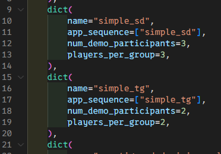

## コード

<details><summary> `__init__.py` の中身</summary>

```python
from otree.api import *

doc = """
Your app description
"""


class C(BaseConstants):
    NAME_IN_URL = "simple_tg"
    PLAYERS_PER_GROUP = None
    NUM_ROUNDS = 1
    ENDOWMENT = 100
    BC_RATIO = 3


class Subsession(BaseSubsession):
    pass


class Group(BaseGroup):
    send_amount = models.CurrencyField(min=0, max=100)
    send_back_amount = models.CurrencyField()


class Player(BasePlayer):
    pass


# FUNCTIONS
def multiplying_send_amount(send_amount: int):
    return send_amount * C.BC_RATIO


def calculate_sender_payoff(send_amount: int, send_back_amount: int):
    return C.ENDOWMENT - send_amount + send_back_amount


def calculate_sendbacker_payoff(send_amount: int, send_back_amount: int):
    return multiplying_send_amount(send_amount) - send_back_amount


def set_payoffs(group: Group):
    group.get_player_by_id(1).payoff = calculate_sender_payoff(
        group.send_amount, group.send_back_amount
    )
    group.get_player_by_id(2).payoff = calculate_sendbacker_payoff(
        group.send_amount, group.send_back_amount
    )


# PAGES
class Send(Page):
    form_model = "group"
    form_fields = ["send_amount"]

    @staticmethod
    def is_displayed(player: Player):
        return player.id_in_group == 1

    @staticmethod
    def vars_for_template(player: Player):
        return {"endowment": C.ENDOWMENT}


class WaitSend(WaitPage):
    @staticmethod
    def is_displayed(player: Player):
        return player.id_in_group == 2


class SendBack(Page):
    form_model = "group"
    form_fields = ["send_back_amount"]

    @staticmethod
    def is_displayed(player: Player):
        return player.id_in_group == 2

    @staticmethod
    def vars_for_template(player: Player):
        group = player.group
        return {"multiplyed_send_amount": multiplying_send_amount(group.send_amount)}


class WaitSendbacker(WaitPage):
    @staticmethod
    def is_displayed(player: Player):
        return player.id_in_group == 1


class ResultsWaitPage(WaitPage):
    after_all_players_arrive = set_payoffs


class Results(Page):
    @staticmethod
    def vars_for_template(player: Player):
        group = player.group
        return {
            "payoff": player.payoff,
            "bc_ratio": C.BC_RATIO,
            "send_amount": group.send_amount,
            "multiplyed_send_amount": multiplying_send_amount(group.send_amount),
            "send_back_amount": group.send_back_amount,
            "total_send_amount": group.get_player_by_id(1).payoff,
            "total_received_amount": group.get_player_by_id(2).payoff,
        }


page_sequence = [
    Send,
    WaitSend,
    SendBack,
    WaitSendbacker,
    ResultsWaitPage,
    Results,
]

```

</details>

<details><summary> `Send.html` の中身</summary>

```html
{{ block title }} Send {{ endblock }} {{ block content }}

<p>あなたは <strong>最初に送る人</strong> に選ばれました</p>
<p>
	あなたは
	<strong>{{ endowment }}</strong>
	ポイントを持っています．
</p>
<p>{{ endowment }} ポイントのうち，何ポイントをペアに与えますか？</p>
{{ formfields }} {{ next_button }} {{ endblock }}
```

</details>

<details><summary> `SendBack.html` の中身</summary>

```html
{{ block title }} Send back {{ endblock }} {{ block content }}

<p>あなたは <strong>お返しする人</strong> に選ばれました</p>
<p>
	あなたは
	<strong>送り手</strong> から
	<strong>{{ multiplyed_send_amount }}</strong>
	ポイントを受け取りました．
</p>
<p>
	相手から受け取った
	<strong> {{ multiplyed_send_amount }} ポイント </strong
	>のうち，何ポイントをペアに与えますか？
</p>

{{ formfields }} {{ next_button }} {{ endblock }}
```

</details>

<details><summary> `Results.html` の中身</summary>

```html
{{ block title }} Results {{ endblock }} {{ block content }}

<div>
    <h2>取引が終了しました</h2>
    <p>あなたは <strong>{{ payoff }} ポイント</strong>を獲得しました</p>
</div>

<div>
    <p><strong>取引の流れ</strong></p>
    <ol>
        <li>最初に送る人が， <strong>{{ send_amount }}</strong>ポイントを送った</li>
        <li>
            実験者が，送ったポイントを <strong>{{ bc_ratio }}</strong>倍（つまり，
            {{ multiplyed_send_amount }}ポイント）にした
        </li>
        <li>
            お返しする人が， <strong>{{ send_back_amount }}</strong>ポイントを返した
        </li>
    </ol>
    <p>
        結果，それぞれのポイントは以下のようになりました
        <ul>
            <li>最初に送る人のポイント: {{ total_send_amount }}</li>
            <li>お返しする人のポイント: {{ total_received_amount }}</li>
        </ul>
    </p>
</div>
{{ next_button }} {{ endblock }}

```

</details>

## 7.2 `otree devserver` でサーバーを起動

コードの編集が終わったら，コマンドプロンプトやターミナルで:

```bash
otree devserver
```

を実行してください．
成功すると，以下のような画面になるはずです．


成功したら，`http://localhost:8000` （または表示された URL）にアクセスできるはずです．
アクセス後に以下のような画面になれば，成功です！


## 7.3 簡単な動作確認

1. ブラウザで `http://localhost:8000/` を開く（上の画像のような画面にになっていれば OK！）．
2. 今回のアプリ（`simple_tg`）をクリックする．
3. 画面中央にある「Play in split screen mode」（オレンジ色の枠）をクリックする．


4. 画面上部が管理者画面，下部がプレイヤー画面になります．画面を操作して，どんな動きをするか確認してみましょう！

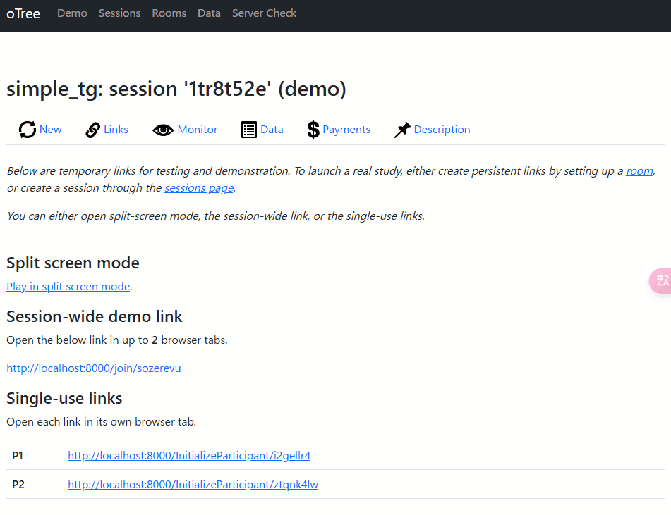

以上で，実験の実装と実行が完了しました！
ここまで完走した皆さんはとても素晴らしいです！！！

# 8. 拡張のアイデア

このようなシンプルなひな形があれば，様々な実験を作ることができます．以下は，このサンプルを拡張するアイデアですので，ぜひ参考にしてください！

- **ラウンド数を増やす**  
  例えば `C.NUM_ROUNDS = 5` に変更すると，全 5 ラウンド分の選択と結果表示を行えます．
- **WaitPage の改良**  
  結果表示前に，チャットページ（Chat クラスを使用）や追加の質問ページを挟むなど，ユーザーインタラクションを強化できます．
- **利得計算の変更**  
  送り手の送ったポイントを増やすだけでなく，返す人が送る人に与えるポイントを変化させるなど，利得計算のロジックを変更できます．

# 9. まとめ

ここまで読んでいただきありがとうございます！  
今回は「信頼ゲーム」を題材に，oTree で最小限の機能を持つサンプル実験を作ってみました．oTree は「Python を使った Web 実験」というと一見難しそうですが，シンプルなプロジェクト構成とテンプレートのおかげで，初めての人でも比較的スムーズに始められます．

**押さえておきたいポイント**

- `__init__.py` にロジックが集中している
- HTML テンプレートを使って画面を自由にデザインできる
- WaitPage を使って全プレイヤーが入力を完了するのを待ち，共通の利得計算を行う

このあたりを理解しておけば，応用で色々な実験を作りやすくなります．

以上が，今回のサンプル実験の解説です．  
ぜひ，記事の構成やコードをもとに，いろんな形の社会実験を作ってみてください！もし分からないところがあれば，公式ドキュメントをチェックしたり，コミュニティに質問してみたりするとよいですよ．皆さんの研究や学習に役立てば嬉しいです！

# 謝辞

本記事は ChatGPT と Gemini を使って執筆しました．
ロングコンテクストは Gemini が飛びぬけて優秀ですね...
